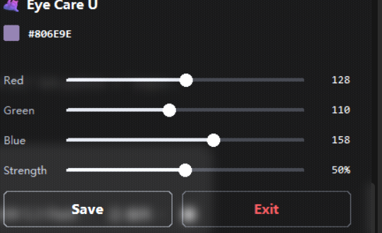

# Eye Care U（eye-care-u）



Windows 托盘常驻护眼工具：改写显卡驱动层 Gamma Ramp 给屏幕物理输出染色，
压低黑白对比度。无遮罩窗口、零输入干扰，任何分辨率/多显示器全覆盖
（与 f.lux / Windows 夜间模式同层原理）。

## 功能

- Gamma Ramp 硬件级染色：无遮罩窗口、不拦截任何输入、游戏全屏也可用
- 亚克力半透明玻璃控制面板（Win10/11 实测；老系统自动回退纯色深底）
- Red / Green / Blue / Strength 四通道滑杆实时调色，所见即所得
- Save 显式保存设置；Exit 退出并自动恢复原色
- 托盘悬停提示；热键 Ctrl+Alt+Q 随时退出并恢复原色
- 多显示器同时生效；周期重刷防止被游戏/其他软件重置

## 使用

双击 `dist/eye-care-u.exe`（单文件免安装），启动即自动开染。

- 左键/右键托盘图标：弹出玻璃控制面板；点面板外部或 Esc 关闭
- 拖动滑杆实时染色；**Save** 保存设置；**Exit** 退出并恢复原色
- 托盘悬停提示：Eye Care U
- 热键 Ctrl+Alt+Q：退出并恢复原色彩
- 设置保存在 exe 旁的 `dist/eye_care_u_settings.json`（面板上按 Save 落盘）

托盘面板为亚克力半透明玻璃风格（背后内容模糊透出）；个别老系统不支持时
自动回退纯色深底，功能不受影响。

## 文件结构

```
eye_care_u.py        全部源码（Gamma 染色 + 自绘托盘 + 玻璃控制面板）
build.bat            一键打包（自动建 venv → 从 logo.png 生成 ico → PyInstaller → 图标校验）
eye-care-u.spec      PyInstaller 打包配置（随 CLI 构建自动再生）
assets/logo.png/.ico 彩色渐变加菲猫 logo（托盘图标 / 面板 / exe 图标共用）
tools/               构建 & QA 工具（make_ico、probe_icon_resources、menu_qa、
                     fullview、menu_sim、recolor_logo、extract_exe_icon、glass_probe）
design/              界面效果图与设计稿
docs/screenshot.png  控制面板截图
dist/                打包产物（git 不入库）
```

## 从源码运行

需要**带 tkinter 的 Python**（3.8+）加 pillow：

```
python eye_care_u.py          # 正常启动
python eye_care_u.py --test   # 无界面染色 3 秒自测
```

## 打包

`build/` 与 `.build-venv/` 是可随时删除的中间产物，删除后按下面重建。

最省事：双击 `build.bat`——自动创建 `.build-venv`（缺失时）、装依赖、
从 `assets/logo.png` 重生成多尺寸 `logo.ico`、PyInstaller 打包并运行图标
完整性校验。打包前需先退出正在运行的程序（运行中的 exe 会锁文件）。

手动等价操作：

```
:: 1) 一次性建打包环境
python -m venv .build-venv
.build-venv\Scripts\python -m pip install pyinstaller pillow

:: 2) 打包（二选一，产物都在 dist/）
.build-venv\Scripts\pyinstaller eye-care-u.spec
.build-venv\Scripts\python -m PyInstaller --onefile --noconsole --name eye-care-u --icon assets/logo.ico --add-data "assets/logo.png;assets" eye_care_u.py
```

## 实现说明

- **玻璃面板**：DwmEnableBlurBehindWindow（空区域）+ DwmExtendFrameIntoClientArea(-1)
  + SetWindowCompositionAttribute(ACCENT_ENABLE_BLURBEHIND)，画布以纯黑为底
  （DWM 下"黑色即玻璃"），可参考 `tools/glass_probe.py` 的方案矩阵实测。
- **换 logo 只改一个文件**：`assets/logo.png` 是唯一来源。build.bat 打包前会
  自动从它重生成多尺寸 `logo.ico`（exe 图标），与托盘图标/面板永远同步。
- PyInstaller 6.x 对本项目多尺寸 ico（PNG 压缩帧）能正确嵌入全部 16–256px 尺寸。
- HDR / 10bit 显示模式下 Gamma Ramp 不可用，程序会写 `eye_care_u_error.log`。
