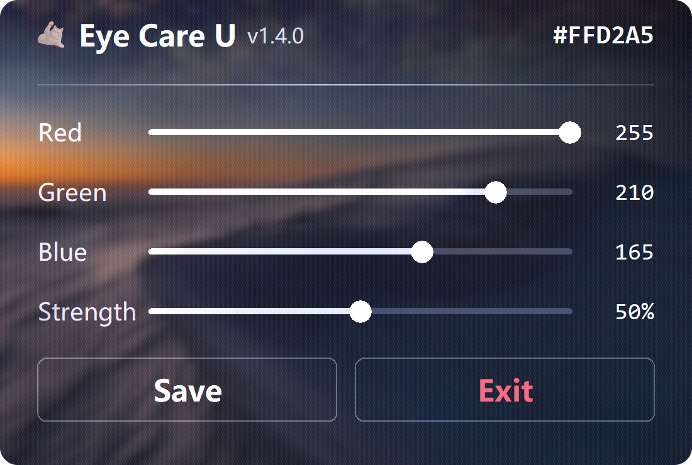

# Eye Care U（eye-care-u）



Windows 托盘常驻护眼工具：改写显卡驱动层 Gamma Ramp 给屏幕物理输出染色，
压低黑白对比度。无遮罩窗口、零输入干扰，任何分辨率/多显示器全覆盖
（与 f.lux / Windows 夜间模式同层原理）。

## 下载

前往 [Releases](https://github.com/suntectec/eye-care-u/releases/latest) 下载最新版
`eye-care-u.exe`（单文件免安装）。

## 功能

- Gamma Ramp 硬件级染色：无遮罩窗口、不拦截任何输入、游戏全屏也可用
- 亚克力半透明玻璃控制面板（Win10/11 实测；老系统自动回退纯色深底）
- Red / Green / Blue / Strength 四通道滑杆实时调色，所见即所得
- Save 显式保存设置；Exit 退出并自动恢复原色
- 托盘悬停提示；热键 Ctrl+Alt+Q 随时退出并恢复原色
- 多显示器同时生效；周期重刷防止被游戏/其他软件重置

## 使用

双击 `eye-care-u.exe`，启动即自动开染。

- 左键/右键托盘图标：弹出玻璃控制面板；点面板外部或 Esc 关闭
- 拖动滑杆实时染色；**Save** 保存设置；**Exit** 退出并恢复原色
- 热键 Ctrl+Alt+Q：退出并恢复原色彩
- 设置保存在 exe 旁的 `eye_care_u_settings.json`（面板上按 Save 落盘）

## 从源码运行

需要**带 tkinter 的 Python**（3.8+）加 pillow：

```
python eye_care_u.py          # 正常启动
python eye_care_u.py --test   # 无界面染色 3 秒自测
```

## 打包

双击 `build.bat` 即可：自动建 `.build-venv`、装依赖、从 `assets/logo.png`
生成多尺寸 `logo.ico`、PyInstaller 打包并校验图标。打包前需先退出正在运行的
程序（运行中的 exe 会锁文件）。

## 实现说明

- **玻璃面板**：DwmEnableBlurBehindWindow + DwmExtendFrameIntoClientArea(-1)
  + SetWindowCompositionAttribute，画布以纯黑为底（DWM 下"黑色即玻璃"），
  方案矩阵见 `tools/glass_probe.py`。
- **换 logo 只改一个文件**：`assets/logo.png` 是唯一来源，build.bat 打包前自动
  从它重生成 `logo.ico`，与托盘图标/面板永远同步。
- HDR / 10bit 显示模式下 Gamma Ramp 不可用，程序会写 `eye_care_u_error.log`。
